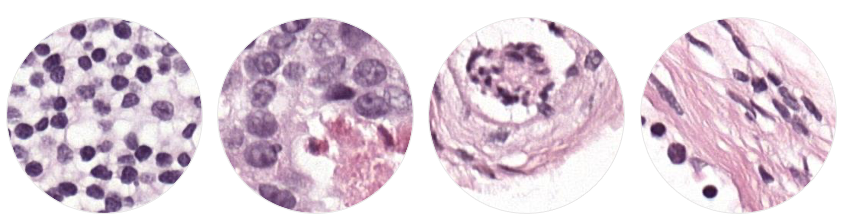
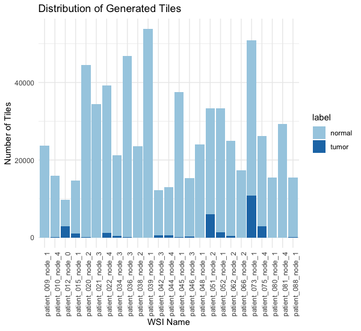

# tumor-finder
A framework for training ML models for tumor recognition on H&amp;E WSIs



### Download repo

To clone this repo and start this project, run the following:

```
git clone https://github.com/amcrabtree/tumor-finder.git
```

### Download Data

This script can either use Patch Camelyon whole slide images (WSIs) or your own annotated WSIs from H&E stained slides. If you annotate your own slides, do it on QuPath and export the geojson file with all the options selected. This script accepts XML annotations (used for PCam dataset) or the QuPath .geojson formatted annotations. These are ROI-type annotations, not point annotations (as would be used in per-cell phenotyping). 

To download a sample of 25 tumor-containing WSIs from the PCam dataset, run the following. Note that downloading may take approximately 24 hours. 

```
cd tumor-finder
sh ./scripts/pcam_download.sh
```

### Tile WSIs

In order to perform the training, the model needs image tiles (sub-images). To tile the WSIs, run the following:

```
python3 ./scripts/preprocess.py ./config/template_config.json
```



### Train a model

By default, VGG-16 with model weights is used. It is easy to swap out in the script `training.py` if you want to use something else. This script was written using PyTorch libraries and my own array of scripts in the `./scripts/tumor_utils` directory. 

To change the run parameters including number of epochs and batch size, etc. you can create a new config file or edit the existing one found in `./config/template_config.json`. 

```
python3 ./scripts/training.py ./config/template_config.json
```

### Test the trained model

To test the model, run the following to produce a test_stats.csv file in the project output folder. 

```
python3 ./scripts/test_metrics.py ./config/template_config.json
```

### FAQ

#### *What to do if tiling stops prematurely?*

If your tiling is interrupted and you're okay with just using the tiles generated, run the following to sort files properly:

```
python ./scripts/tumor_utils/mv_tiles.py ./data/tiles
```

Proceed to train your model. 
